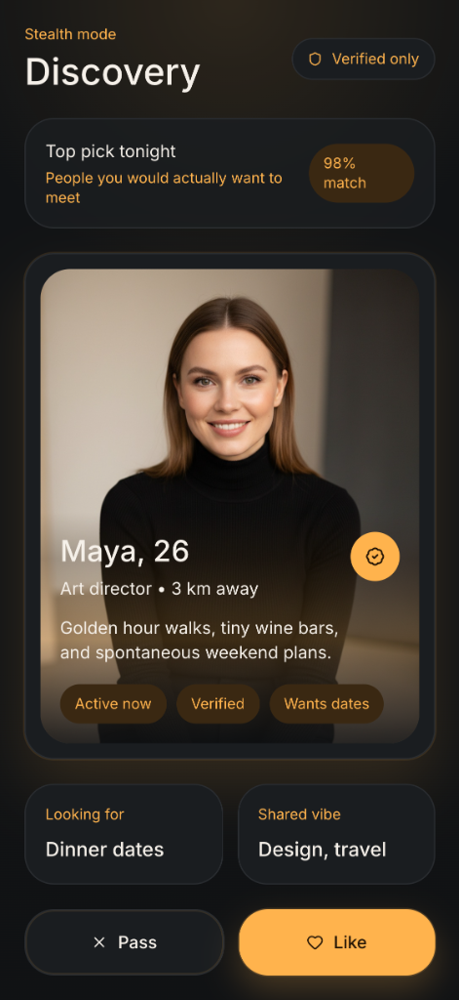

# 🔥 Flame Dating

**Bold. Premium. Sophisticated.**

Flame is a high-fidelity dating application built with React Native and Expo. It features a unique Cyber-Amber aesthetic, optimized for a premium user experience with smooth animations and a focus on meaningful connections.

## 📸 Screenshots

<p align="center">
  
  
  
</p>

## ✨ Features

- 🌟 **Cyber-Amber UI** — A premium Amber and Graphite theme that feels technical, high-end, and gender-neutral.
- 💖 **Swipe Architecture** — Intuitive swipe-to-match interface with smooth animations.
- 📱 **Responsive Layout** — Fully optimized for all screen sizes (iOS & Android).
- 💬 **Real-time Vibe** — Designed for high-engagement social interactions.
- 🌓 **Stealth Dark Mode** — A sophisticated "Midnight" dark mode designed for a sleek, technical aesthetic.
- ⚡ **React Native Reanimated** — Powering buttery-smooth card transitions and interactions.

## 🛠️ Tech Stack

- **Framework**: [React Native](https://reactnative.dev)
- **Runtime**: [Expo SDK 50](https://expo.dev)
- **Animations**: [Reanimated 3](https://docs.swmansion.com/react-native-reanimated/)
- **Icons**: [Lucide React Native](https://lucide.dev)
- **Styling**: StyleSheet + [Expo Linear Gradient](https://docs.expo.dev/versions/latest/sdk/linear-gradient/)

## 🚀 Getting Started

1. Clone the repository:
   ```bash
   git clone https://github.com/Adonias-hibeste/React-Native-Dating-App-.git
   ```
2. Install dependencies:
   ```bash
   npm install
   ```
3. Start the project:
   ```bash
   npx expo start
   ```

## 👨‍💻 Developer

**Adonias Hibeste** — Lead Mobile Developer

---

*Note: This repository is a technical showcase of high-fidelity UI and smooth animation implementation in React Native.*
